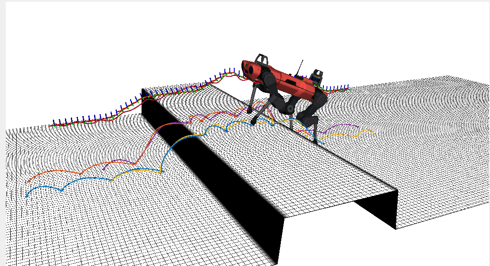
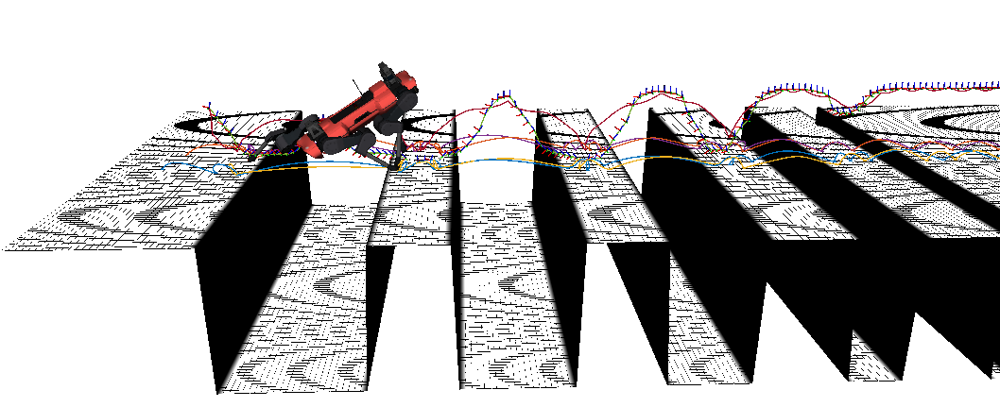
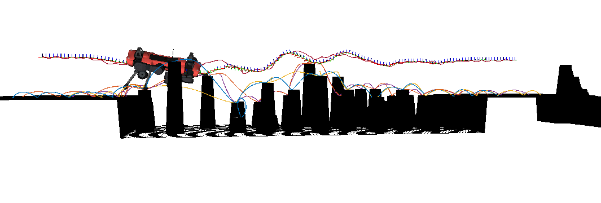

# OCS2 Anymal Loopshaping MPC

This package provided a perceptive mpc demo to allow Anymal_c robot to cross different terrains.

## 1. Build the package

```bash
cd ~/ros2_ws/
colcon build --packages-up-to ocs2_anymal_loopshaping_mpc --symlink-install
```

## 2. Perceptive MPC demo

In this launch file, you can try different terrains.

### 2.1 basic step

```bash
source ~/ros2_ws/install/setup.bash
ros2 launch ocs2_anymal_loopshaping_mpc perceptive_mpc_demo.launch.py
```



### 2.2 side gap

```bash
source ~/ros2_ws/install/setup.bash
ros2 launch ocs2_anymal_loopshaping_mpc perceptive_mpc_demo.launch.py terrain_name:=side_gap.png
```


### 2.3 gaps

```bash
source ~/ros2_ws/install/setup.bash
ros2 launch ocs2_anymal_loopshaping_mpc perceptive_mpc_demo.launch.py terrain_name:=gaps.png terrain_scale:=1.0 forward_distance:=7.0
```



### 2.4 hurdles

```bash
source ~/ros2_ws/install/setup.bash
ros2 launch ocs2_anymal_loopshaping_mpc perceptive_mpc_demo.launch.py terrain_name:=hurdles.png terrain_scale:=0.7 forward_distance:=7.0
```


### 2.5 stepping stones

```bash
source ~/ros2_ws/install/setup.bash
ros2 launch ocs2_anymal_loopshaping_mpc perceptive_mpc_demo.launch.py terrain_name:=stepping_stones.png terrain_scale:=1.0 forward_distance:=7.0
```



## 3. ToGo Prototype perceptive MPC demo

```bash
source ~/ros2_ws/install/setup.bash
ros2 launch ocs2_anymal_loopshaping_mpc togo_prototype_perceptive_mpc_demo.launch.py
```

By default this exports each computed motion dataset to a timestamped
subdirectory under:

```text
/home/dw/workspace/opendog_ros2/date/
```

Each export contains CSV files for the motion arrays, `metadata.json` with
names/shapes/units, `export_schema.json` with the AMP loader requirements,
`scenario_metadata.json`, `robot.urdf`, a copy of the source terrain image, and
CSV exports of the raw and filtered elevation maps.
