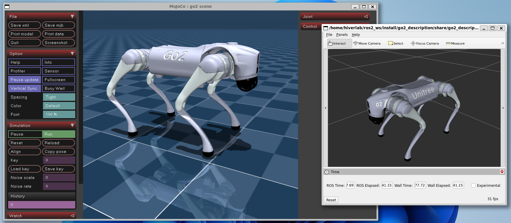
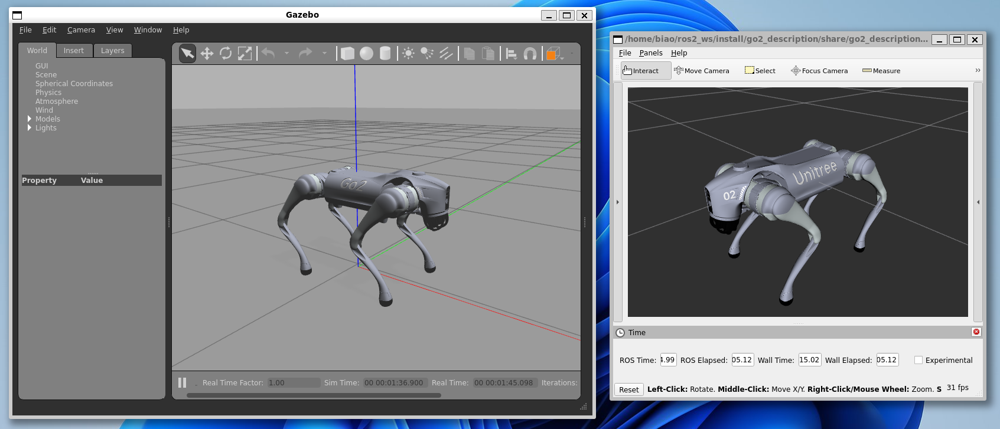
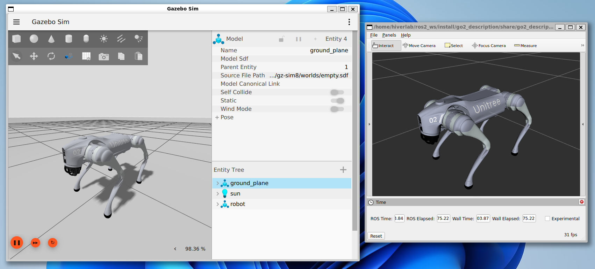

┌─────────────────────────────────────────────────────────────┐
│  第 0 层：启动 / 编译 / 配置层                                │
│  launch.py、robot.xacro、robot_control.yaml、task.info        │
│  reference.info、gait.info、URDF、CppAD 自动生成库             │
└──────────────────────────────┬──────────────────────────────┘
                               │
                               ▼
┌─────────────────────────────────────────────────────────────┐
│  第 1 层：机器人模型层                                        │
│  URDF / Xacro / mesh / inertial / joint axis / foot frame     │
│  base_link、hip、thigh、calf、foot、IMU、contact sensor        │
└──────────────────────────────┬──────────────────────────────┘
                               │
                               ▼
┌─────────────────────────────────────────────────────────────┐
│  第 2 层：仿真或真机硬件接口层                                │
│  Gazebo / MuJoCo / 真机驱动 / ros2_control hardware plugin    │
│  提供 joint state、IMU、足端力；接收 torque、pos、vel、kp、kd  │
└──────────────────────────────┬──────────────────────────────┘
                               │
                               ▼
┌─────────────────────────────────────────────────────────────┐
│  第 3 层：ros2_control 层                                     │
│  controller_manager                                           │
│  加载 ocs2_quadruped_controller                              │
│  管理 command_interface 和 state_interface                    │
└──────────────────────────────┬──────────────────────────────┘
                               │
                               ▼
┌─────────────────────────────────────────────────────────────┐
│  第 4 层：状态估计层 State Estimator                          │
│  joint state + IMU + foot contact / foot force                │
│  估计 base position、base velocity、base orientation          │
└──────────────────────────────┬──────────────────────────────┘
                               │
                               ▼
┌─────────────────────────────────────────────────────────────┐
│  第 5 层：目标与步态层                                        │
│  TargetManager / GaitManager                                  │
│  目标速度、目标姿态、stance、trot、standing_trot 等模式        │
│  输出 planned contact mode                                    │
└──────────────────────────────┬──────────────────────────────┘
                               │
                               ▼
┌─────────────────────────────────────────────────────────────┐
│  第 6 层：OCS2 MPC 层                                         │
│  根据当前状态 + 目标 + 约束 + 代价函数                         │
│  求解未来一段时间的 MPC policy                                │
│  输出 optimized_state、optimized_input、planned_mode          │
└──────────────────────────────┬──────────────────────────────┘
                               │
                               ▼
┌─────────────────────────────────────────────────────────────┐
│  第 7 层：MRT 层                                              │
│  MPC_MRT_Interface                                            │
│  保存、更新、插值 MPC policy                                  │
│  实时控制循环从这里取当前时刻的参考状态和输入                 │
└──────────────────────────────┬──────────────────────────────┘
                               │
                               ▼
┌─────────────────────────────────────────────────────────────┐
│  第 8 层：WBC 层                                              │
│  Whole Body Control                                           │
│  根据 optimized_state / optimized_input / measured_state      │
│  求解关节 torque、期望 position、期望 velocity、kp、kd         │
└──────────────────────────────┬──────────────────────────────┘
                               │
                               ▼
┌─────────────────────────────────────────────────────────────┐
│  第 9 层：低层执行层                                          │
│  ros2_control 写入 command_interface                          │
│  仿真器或电机执行 torque / PD command                         │
└──────────────────────────────┬──────────────────────────────┘
                               │
                               ▼
┌─────────────────────────────────────────────────────────────┐
│  第 10 层：机器人动力学反馈                                   │
│  机器人运动、足端接触、IMU变化、关节反馈                       │
│  再反馈回状态估计层                                           │
└─────────────────────────────────────────────────────────────┘


# Quadruped ROS2 Control

**ROS2 Humble Branch**

This repository contains the ros2-control based controllers for the quadruped robot.

* [Controllers](controllers): contains the ros2-control controllers
* [Commands](commands): contains command node used to send command to the controller
* [Descriptions](descriptions): contains the urdf model of the robot
* [Hardwares](hardwares): contains the ros2-control hardware interface for the robot

Todo List:

- [x] **[2025-02-23]** Add Gazebo Playground
  - [x] OCS2 controller for Gazebo Simulation
  - [x] Refactor FSM and Unitree Guide Controller
- [x] **[2025-03-30]** Add Real Go2 Robot Support
- [ ] OCS2 Perceptive locomotion demo

Video on Real Unitree Go2 Robot:
[](https://www.bilibili.com/video/BV1QpZaY8EYV/)

## 1. Quick Start

* rosdep
    ```bash
    cd ~/ros2_ws
    rosdep install --from-paths src --ignore-src -r -y
    ```
* Compile the package
    ```bash
    colcon build --packages-up-to unitree_guide_controller go2_description keyboard_input --symlink-install
    ```

### 1.1 Mujoco Simulator or Real Unitree Robot
> **Warning:** CycloneDDS ROS2 RMW may conflict with unitree_sdk2. If you cannot launch unitree mujoco simulation
> without `sudo`, then you cannot used `unitree_mujoco_hardware`. This conflict could be solved by one of below two
> methods:
> 1. Uninstall CycloneDDS ROS2 RMW, used another ROS2 RMW, such as FastDDS **[Recommended]**.
> 2. Follow the guide in [unitree_ros2](https://github.com/unitreerobotics/unitree_ros2) to configure the ROS2 RMW by
     compiling cyclone dds.

* Compile Unitree Hardware Interfaces
    ```bash
    cd ~/ros2_ws
    colcon build --packages-up-to hardware_unitree_mujoco
    ```
* Follow the guide in [unitree_mujoco](https://github.com/legubiao/unitree_mujoco) to launch the unitree mujoco go2
  simulation
* Launch the ros2-control
    ```bash
    source ~/ros2_ws/install/setup.bash
    ros2 launch unitree_guide_controller mujoco.launch.py
    ```
* Run the keyboard control node
    ```bash
    source ~/ros2_ws/install/setup.bash
    ros2 run keyboard_input keyboard_input
    ```



### 1.2 Gazebo Classic Simulator (ROS2 Humble)

* Install Gazebo Classic
  ```bash
  sudo apt-get install ros-humble-gazebo-ros ros-humble-gazebo-ros2-control
  ```
* Compile Leg PD Controller
    ```bash
    colcon build --packages-up-to leg_pd_controller
    ```
* Launch the ros2-control
    ```bash
    source ~/ros2_ws/install/setup.bash
    ros2 launch unitree_guide_controller gazebo_classic.launch.py
    ```
* Run the keyboard control node
    ```bash
    source ~/ros2_ws/install/setup.bash
    ros2 run keyboard_input keyboard_input
    ```



### 1.3 Gazebo Harmonic Simulator (ROS2 Jazzy&Humble)
> For ROS2 Humble User, please check [Here](hardwares/gz_quadruped_hardware)
* Install Gazebo
  ```bash
  sudo apt-get install ros-jazzy-ros-gz
  ```

* Compile Gazebo Playground
  ```bash
  colcon build --packages-up-to gz_quadruped_playground --symlink-install
  ```
* Launch the ros2-control
  ```bash
  source ~/ros2_ws/install/setup.bash
  ros2 launch unitree_guide_controller gazebo.launch.py
  ```
* Run the keyboard control node
    ```bash
    source ~/ros2_ws/install/setup.bash
    ros2 run keyboard_input keyboard_input
    ```



For more details, please refer to the [unitree guide controller](controllers/unitree_guide_controller/)
and [go2 description](descriptions/unitree/go2_description/).

## What's Next
Congratulations! You have successfully launched the quadruped robot in the simulation. Here are some suggestions for you to have a try:
* **More Robot Models** could be found at [description](descriptions/)
* **Try more controllers**. 
  * [OCS2 Quadruped Controller](controllers/ocs2_quadruped_controller): Robust MPC-based controller for quadruped robot
  * [RL Quadruped Controller](controllers/rl_quadruped_controller): Reinforcement learning controller for quadruped robot
* **Simulate with more sensors**
  * [Gazebo Quadruped Playground](libraries/gz_quadruped_playground): Provide gazebo simulation with lidar or depth camera.
* **Real Robot Deploy**
  * [Unitree Go2 Robot](descriptions/unitree/go2_description): Check here about how to deploy on go2 robot.

## Reference

### Conference Paper

[1] Liao, Qiayuan, et al. "Walking in narrow spaces: Safety-critical locomotion control for quadrupedal robots with
duality-based optimization." In *2023 IEEE/RSJ International Conference on Intelligent Robots and Systems (IROS)*, pp.
2723-2730. IEEE, 2023.

### Miscellaneous

[1] Unitree Robotics. *unitree\_guide: An open source project for controlling the quadruped robot of Unitree Robotics,
and it is also the software project accompanying 《四足机器人控制算法--建模、控制与实践》 published by Unitree
Robotics*. [Online].
Available: [https://github.com/unitreerobotics/unitree_guide](https://github.com/unitreerobotics/unitree_guide)

[2] Qiayuan Liao. *legged\_control: An open-source NMPC, WBC, state estimation, and sim2real framework for legged
robots*. [Online]. Available: [https://github.com/qiayuanl/legged_control](https://github.com/qiayuanl/legged_control)

[3] Ziqi Fan. *rl\_sar: Simulation Verification and Physical Deployment of Robot Reinforcement Learning Algorithm.*

2024. Available: [https://github.com/fan-ziqi/rl_sar](https://github.com/fan-ziqi/rl_sar) 